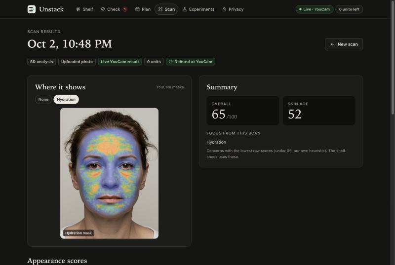
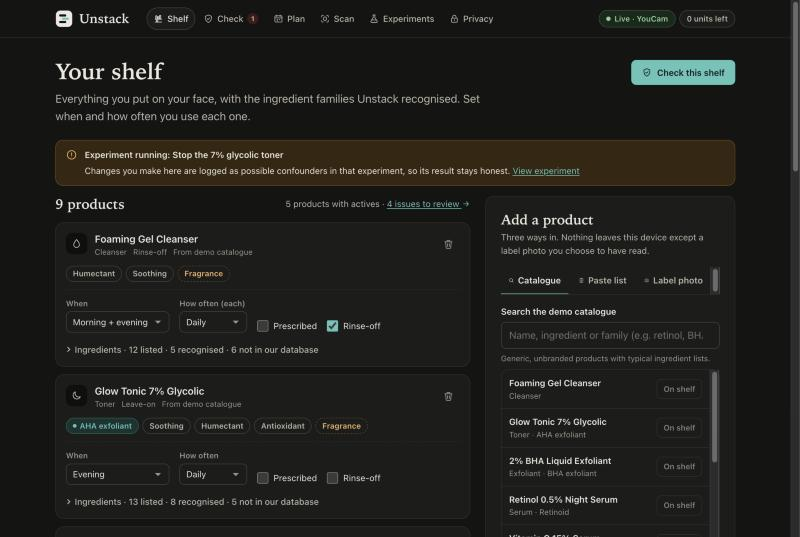
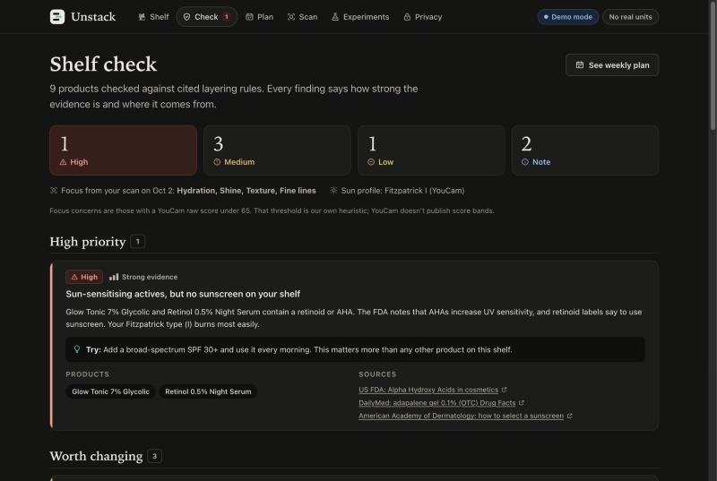
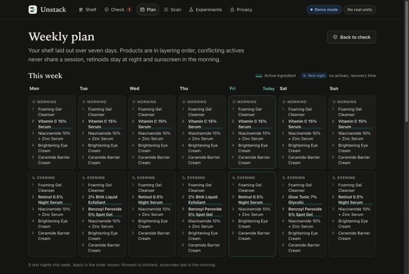
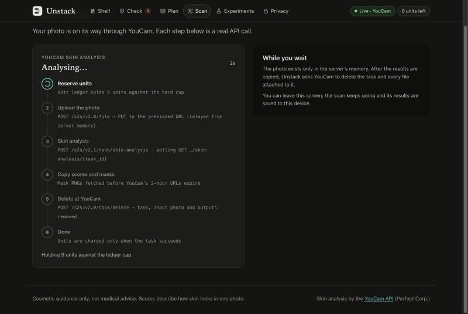
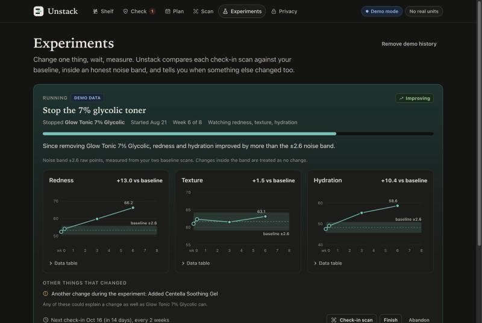
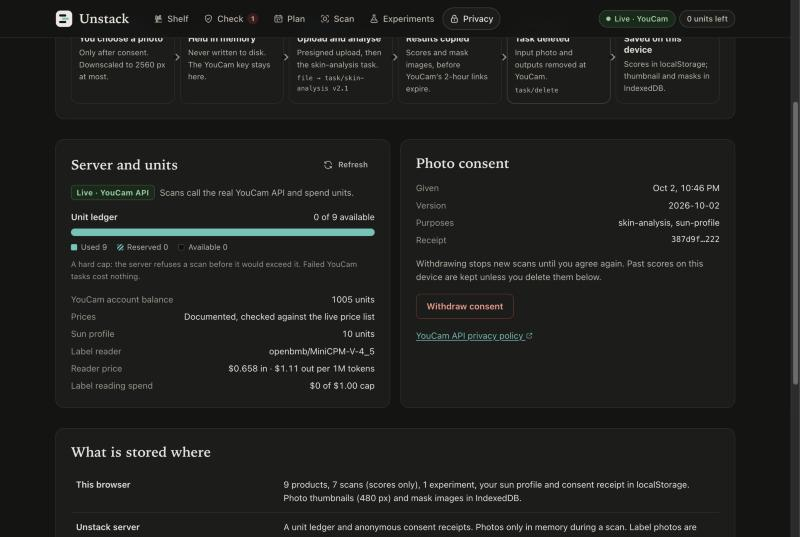

# Unstack

**Check your skincare shelf before you layer it, then change one thing at a time.**

Unstack is our entry for the YouCam API Skin AI & eCommerce VTO Hackathon, in the Skin AI track. It is built on the YouCam Skin Analysis API, the Fitzpatrick Skin Type API and the JS Camera Kit.



## What it does, and who it's for

It's for people with multi-step routines, especially people who build routines from social media and stack actives. Retinoid, glycolic toner, BHA and benzoyl peroxide on the same night is common, and so is owning no sunscreen. Unstack answers three questions.

1. **Is my shelf safe to layer?**
   - **Adding products.** Pick from a demo catalogue, paste an ingredient list, or photograph the label (a vision model transcribes it, and you review the text before it is saved).
   - **What the rule engine flags.** Layering conflicts, sun-sensitising actives with no sunscreen on the shelf, actives you are paying for twice, and fragrance when redness is a focus.
   - **What it says is fine.** It also says what is *not* a conflict.
   - **Evidence.** Every finding states how strong the evidence is and links its sources (FDA, DailyMed, AAD and others).
2. **When do I use what?** A weekly plan puts the shelf into morning and evening sessions over 7 days, so conflicting actives never share a session. Retinoids go at night and sunscreen in the morning.
3. **Is it doing anything for me?**
   - **Skin scan.** It runs the YouCam Skin Analysis API on the concerns you pick, and shows the unit cost before you press the button.
   - **Shelf mapping.** Results are mapped to your shelf: which products are commonly used for the concerns the scan flagged, and which products target nothing you care about (candidates to stop re-buying).
   - **One-change experiments.** You change one product, rescan every two weeks and see per-concern trends against your baseline, inside a noise band measured from your own baseline scans. Unstack warns you when something else changed too.

Unstack makes **no medical claims**:
- scores are called "appearance scores";
- guidance is cosmetic;
- prescription products get "follow your prescriber";
- the Fitzpatrick type only raises the priority of the "no sunscreen" finding and is never presented as a diagnosis.

| Shelf | Check | Plan |
|---|---|---|
|  |  |  |
| **Scan (live, in progress)** | **Experiments** | **Privacy (live)** |
|  |  |  |

## How Unstack uses the YouCam API

Every call goes through the Unstack server, which holds the key. The browser never sees it.

| Endpoint | Why Unstack calls it |
|---|---|
| `POST /s2s/v2.0/file`, then the presigned `PUT` | Upload the user's photo straight from server memory. The `PUT` sends only the headers YouCam returns and no auth. The sample faces use `src_file_url` instead, since they're already public. |
| `POST /s2s/v2.1/task/skin-analysis` | The scan. See the notes below this table. |
| `GET /s2s/v2.1/task/skin-analysis/{task_id}` | Poll with back-off (1.5 s, rising to 5 s, with a 3-minute timeout). The Scan screen shows each step live, with the call it makes. |
| `POST /s2s/v2.0/task/delete` | Called after **every** task, once the masks are copied. We checked live that the result URLs return 404 straight after delete. |
| `POST /s2s/v2.0/task/fitzpatrick-scale-analyzer` + `GET …/{task_id}` | Optional sun profile (10 units). The only thing it changes is the priority of the "sun-sensitising actives, no sunscreen" finding. It accepts JPEG only, so the browser re-encodes everything else first, including PNG samples such as Sample A, and sends the result as an upload. |
| `GET /s2s/v1.0/client/credit` | Free. Checked before each paid task, so a scan is refused up front if the balance is short. The Privacy screen shows it too. |
| `GET /s2s/v2.0/credit/feature-cost` | Free. Live price sync. The server uses the documented price table, which a live price can raise but never lower, and quotes the result before every scan. |
| **JS Camera Kit** (v2.5 SDK) | Guided capture for experiment check-ins: the same distance, pose and lighting thresholds every time, which keeps week-over-week comparisons fair. It is loaded only after consent, and only when the user picks the camera. |

Notes on the skin-analysis call:
- It returns JSON with raw masks (`enable_mask_overlay: false`), so Unstack draws its own overlays.
- SD or HD is picked from the photo size: HD needs a short side of 1080 px or more.
- The user picks the concerns, and the price tier follows from how many they pick.

Errors from YouCam are mapped to plain advice. For example, `error_src_face_too_small` becomes "Face too small: move closer". The detailed protocol notes and the live-verification log are in [`docs/API_NOTES.md`](docs/API_NOTES.md).

**Spending safeguards** (all on the server, all tested):
- **Unit ledger.** A hard cap is kept in `data/unit-ledger.json`. The default is 200 units and no setting can go above 1000.
- **Reservation.** Each scan reserves units before any paid call, and is refused if the cap would be crossed.
- **Settlement.** Units are charged when YouCam reports success and released when YouCam reports a failure. If the outcome is unknown, they count as spent.
- **Rate limits.** A shared limiter covers all YouCam calls (4 per second, 200 per 5 minutes). There is also a per-hour cap on paid tasks, at most 2 jobs run at once, and the label reader is limited to 30 reads an hour.

## Run it

You need Node 22.12 or newer (`node -v`). If your default `node` is older, put a newer one first on `PATH` for this shell only. Nothing has to be installed system-wide. For example, with Homebrew's current `node` formula, which is what we used (Node 26.0.0):

```sh
export PATH="$(brew --prefix node)/bin:$PATH"   # or: nvm use 22 / volta run --node 22 …
node -v                                         # v22.12 or newer
```

### Demo mode (no key needed)

```sh
npm install
npm run dev:mock
# open http://127.0.0.1:8796
```

Demo mode replays real YouCam responses recorded during our live verification on 2026-10-02 (`fixtures/recorded/`, with every URL and id redacted).
- **The whole flow runs:** consent, upload or sample photo, every pipeline stage, task delete, the unit ledger and error cases.
- **The scores are the recorded ones,** whatever photo you use.
- **Masks:** for Sample A the overlays are the real YouCam masks when `fixtures/recorded/masks/` is present. Otherwise Unstack draws an approximate face-zone map.
- **Why the masks aren't in the repo:** they stay git-ignored because no license is stated for YouCam's sample faces, so a fresh clone shows the zone map.
- **Demo history:** to see the experiment charts without waiting six weeks, press **Load demo history** on the Experiments screen.

Without a key the server always runs in demo mode. `UNSTACK_FORCE_MOCK=1` forces it even when a key is set.

### With a YouCam key

```sh
scripts/set-youcam-key.sh   # asks for the key without echoing it, writes .env (mode 600), prints only its length and your balance
npm run dev                 # live mode: real YouCam calls, real units
```

Other settings are in [`.env.example`](.env.example). They include `UNSTACK_UNIT_CAP`, `UNSTACK_MAX_TASKS_PER_HOUR` and the optional label reader (`UNSTACK_NEBIUS_API_KEY`, `UNSTACK_NEBIUS_MODEL`, `UNSTACK_LLM_CAP_USD`). Only `YOUCAM_API_KEY` and `UNSTACK_*` names are read. Generic names like `OPENAI_API_KEY` are ignored on purpose.

**Label reading is separate from YouCam demo mode.** Whenever `UNSTACK_NEBIUS_API_KEY` is set, each label photo you choose is sent to Nebius Token Factory and billed, even under `npm run dev:mock`. The Privacy screen says this too. Without the key, label reading is off: `/api/label-read` answers 503 and the app asks you to paste the list instead.

### Production build and tests

```sh
npm run build && npm start   # serves dist/web on http://127.0.0.1:8796
npm run check                # TypeScript typecheck + 106 tests (76 server, 30 web)
```

## Privacy

Unstack has no accounts.

- **Consent first.** No photo can be chosen until the user confirms they are 18 or older and agrees to named purposes (skin analysis, sun profile). Consent is versioned (`2026-10-02`) and can be withdrawn on the Privacy screen. The server refuses a scan without a current consent, with error codes such as `consent-required`.
- **The photo is held only in server memory.** It is never written to disk. It is uploaded to YouCam through the presigned URL and dropped once the upload is done.
- **YouCam's copy is deleted.** After the scores and masks are copied, Unstack calls `task/delete`. Without that call, YouCam keeps files for up to 30 days.
- **Your data stays on your device.** Shelf, scores, experiments and sun profile are kept in `localStorage`. Photo thumbnails (480 px) and masks are kept in IndexedDB. **Delete everything** on the Privacy screen wipes all of it.
- **The server keeps two things.** It keeps the unit ledger, and consent receipts of the form `{consentId, version, purposes, grantedAt, withdrawnAt}`. Neither holds personal data.
- **Label photos** are forwarded once to the label reader on Nebius Token Factory (whenever its key is set, demo mode included) and never stored. Only the text you approve is saved.
- **The server only answers this app.**
  - It binds to 127.0.0.1.
  - It rejects non-loopback `Host` headers (blocking DNS rebinding) and foreign `Origin` headers.
  - It accepts only `application/json` POST bodies, so other websites can't trigger paid calls.
- **Keys stay on the server.** YouCam and Nebius keys are sent only to their own API hosts, and the tests check this.

## AI assistance disclosure

- **Building it.** Unstack was built with heavy use of AI coding agents (Anthropic's Claude, through Claude Code). Under the entrant's direction, they wrote most of the code, tests and documentation, and ran the browser click-throughs that produced the screenshots here.
- **Inside the app.** AI has one narrow job: transcribing ingredient lists from label photos. It uses the vision model `openbmb/MiniCPM-V-4_5` on Nebius Token Factory, at $0.658 per 1M input tokens and $1.11 per 1M output tokens, with a hard USD cap. The user reviews the text before it is saved. Everything that makes a judgement (the conflict rules, the weekly plan, concern mapping and experiment statistics) is deterministic code with unit tests.
- **Images.** The sample faces are Perfect Corp. images loaded from YouCam's CDN. They are hotlinked, not copied into this repo. No image in this project is AI-generated.

## Project layout

```
shared/   domain logic shared by browser and server: ingredients, rules + sources, schedule, concerns, experiments, pricing, API types
server/   Node http server (no framework): routes, scan pipeline, unit ledger, consent, prices, label reader, YouCam clients (HTTP + mock)
web/      React + Vite front end (six screens)
tests/    server tests (vitest); web tests sit next to their code
fixtures/ redacted recordings from the live YouCam run
docs/     API notes and screenshots
```

Licence: MIT.
